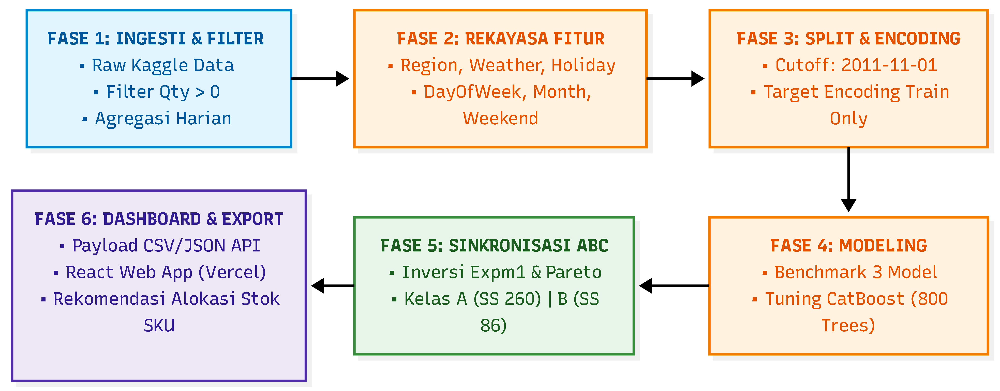

<div align="center">

# 📦 E-Commerce Demand Forecasting & Dynamic Safety Stock System

[](https://ecommerce-demand-forecasting-git-main-ari-1711s-projects.vercel.app/)
[](https://fastapi.tiangolo.com/)
[](#)
[](https://reactjs.org/)
[](https://tailwindcss.com/)

**[🚀 Akses Live Demo (Dashboard Interaktif)](https://ecommerce-demand-forecasting-git-main-ari-1711s-projects.vercel.app/)**

</div>

---

## 📑 Daftar Isi
- [Ringkasan Eksekutif \& Metrik Utama Produksi](#-ringkasan-eksekutif--metrik-utama-produksi)
- [🔄 Engineering Evolution: Riset Akademik vs. Versi Produksi Industri](#-engineering-evolution-riset-akademik-vs-versi-produksi-industri)
- [🗄️ Spesifikasi \& Kutipan Dataset](#️-spesifikasi--kutipan-dataset)
- [📊 Rekayasa 14 Fitur Native](#-rekayasa-14-fitur-native)
- [🏗️ Arsitektur Sistem End-to-End](#️-arsitektur-sistem-end-to-end)
- [📈 Hasil Evaluasi \& Formulasi Dynamic Safety Stock](#-hasil-evaluasi--formulasi-dynamic-safety-stock)
- [🛠️ Kendala Teknis \& Solusi Mitigasi](#️-kendala-teknis--solusi-mitigasi)
- [💻 Fitur Dashboard \& Panduan Menjalankan Lokal](#-fitur-dashboard--panduan-menjalankan-lokal-fastapi--react)
- [📂 Struktur Direktori Proyek](#-struktur-direktori-proyek)
- [👥 Penulis, Kontributor \& Catatan Rilis](#-penulis-kontributor--catatan-rilis)
- [🚀 Roadmap Masa Depan](#-roadmap-masa-depan)

---

## 📌 Ringkasan Eksekutif & Metrik Utama Produksi

**Problem:** Operasional e-commerce sering mengalami tantangan berat berupa *overstock* (kelebihan stok) dan *stockout* (kekosongan stok) akibat dari tingginya volatilitas permintaan musiman serta lonjakan pembelian *wholesale* (grosir).

**Solusi:** Membangun sistem prediksi permintaan multi-step (7 hari ke depan) pada tingkat SKU e-commerce berbasis **CatBoost Regressor**. Sistem ini diintegrasikan dengan klasifikasi **ABC Pareto** dan alokasi **Dynamic Safety Stock** yang adaptif berdasarkan toleransi eror model (MAE), serta divisualisasikan melalui antarmuka dashboard analytics *real-time*.

### Metrik Utama (Sistem Produksi)
- **Model Base:** CatBoost Regressor (800 Trees)
- **Mean Absolute Error (MAE):** 86.41 unit
- **Root Mean Squared Error (RMSE):** 206.56
- **R² Score:** 45.53%
- **Safety Stock Kelas A:** 260 unit (Diformulasikan dari $3 \times MAE$)

---

## 🔄 Engineering Evolution: Riset Akademik vs. Versi Produksi Industri

> 📄 **Catatan Transparansi Riset:** Anda dapat mengakses **[Laporan Penelitian Akademik Awal (v1.0)](https://drive.google.com/file/d/16CGk_kffzf4hZjfDBWCPoUxSJ6-ZbW7t/view?usp=sharing)** (PDF). Dokumen tersebut merupakan versi prototipe riset awal perkuliahan. Harap dicatat bahwa kode di repositori ini dan aplikasi web *live demo* saat ini merupakan **Versi Produksi (v2.0)** yang telah ditingkatkan secara signifikan: 100% bebas dari kebocoran data (*data leakage*), menggunakan 14 fitur *native* tanpa *sparse matrix*, dan menyajikan metrik evaluasi riil yang aman untuk operasional industri.

Proyek ini menyoroti iterasi rekayasa (Engineering Refactor) yang signifikan untuk bertransisi dari fase prototipe riset awal yang rentan, menjadi sistem siap produksi yang efisien, *robust*, dan bebas dari kebocoran data (*data leakage*).

| Aspek | Prototipe Riset Awal (Sebelum Revisi) | Sistem Siap Produksi (Setelah Revisi) | Dampak Signifikan |
| :--- | :--- | :--- | :--- |
| **Urutan Split & Encoding** | Target encoding dihitung pada seluruh dataset **sebelum** split. Terjadi *data leakage* masa depan ke masa lalu. | Time-Series Split (cutoff 1 Nov 2011) dilakukan **LEBIH DULU**. Encoding murni dari *train set*, *missing value* uji diisi `global_train_mean`. | Evaluasi model 100% bebas *leakage* dan merepresentasikan performa riil. |
| **Penanganan Fitur Kategorikal** | Menggunakan One-Hot Encoding (`pd.get_dummies`), menghasilkan 31 kolom dan matriks jarang (*sparse*). | Menggunakan Native Categorical (`category` / `cat_features`), memampatkan fitur menjadi **14 kolom efisien**. | Menghilangkan multikolinearitas dan mempercepat proses inferensi. |
| **Evaluasi CatBoost (800 Trees)** | MAE: **77.47**, RMSE: 186.30, R²: 55.69% (*over-optimistik* akibat data leakage). | MAE: **86.41**, RMSE: 206.56, R²: 45.53% (**metrik reliabel/riil**). | Estimasi kesalahan kini dapat dipercaya untuk sistem logistik aktual. |
| **Safety Stock Kelas A** | 233 unit (berbasis $3 \times MAE$ optimistik). | **260 unit** (berbasis $3 \times MAE$ riil). | Menghindari potensi *stockout* karena batas pengaman sebelumnya *under-estimate*. |

### Pergeseran Peringkat Top SKU Demand (Sebelum vs Sesudah)
Penyelesaian isu kebocoran data menghasilkan penyesuaian angka prediksi pada *top items*:
- 📦 **SKU 23084:** 37,215 unit ➔ **33,238 unit**
- 📦 **SKU 22197:** 36,344 unit ➔ **32,981 unit**
- 📦 **SKU 85099B:** 33,534 unit (Pos 4) ➔ **32,348 unit (Naik ke Pos 3)**
- 📦 **SKU 84077:** 34,297 unit (Pos 3) ➔ **31,710 unit (Turun ke Pos 4)**
- 📦 **SKU 85123A:** 23,970 unit ➔ **27,788 unit**

---

## 🗄️ Spesifikasi & Kutipan Dataset

Proyek ini menggunakan **[E-Commerce Data](https://www.kaggle.com/datasets/carrie1/ecommerce-data/)** terkemuka dari Kaggle.

- **Total Data Mentah:** 531.285 baris transaksi valid (setelah pembersihan data retur/kuantitas non-positif).
- **Data Agregasi & Fitur:** 229.825 baris data deret waktu harian per produk (`StockCode`) dengan 14 fitur (fitur lag/rolling, kalender, hari libur, dan cuaca/wilayah).
- **Target Prediksi:** Permintaan stok horizon jendela 7 hari ke depan (`Quantity_Next_7_Days`).
- **Strategi Pemisahan Data (Time-Series Split):**
  - **Set Pelatihan (87,8% / 201.877 baris):** Rentang waktu 9 Desember 2010 s/d 31 Oktober 2011 untuk pelatihan model dan target encoding bebas *data leakage*.
  - **Set Pengujian (12,2% / 27.948 baris):** Rentang waktu 1 November 2011 s/d 1 Desember 2011 untuk evaluasi performa horizon masa depan.

---

## 📊 Rekayasa 14 Fitur Native

Dataset diproses melalui tahapan rekayasa data mendalam untuk membentuk 14 fitur native (*non-sparse*):
1. **Fitur Temporal (Time-Series):** *Day of week*, bulan, kuartal, dll., diekstraksi dari tanggal pesanan.
2. **Transformasi Lag & Rolling Window:** Menggeser historis penjualan (*lag*) serta menghitung agregasi *rolling window* (rata-rata/total per minggu/bulan).
3. **Native Categorical Fitur:** Pemanfaatan tipe data `category` di Pandas untuk diserap langsung oleh mekanisme pemisahan internal algoritma CatBoost, membatalkan kebutuhan One-Hot Encoding yang mubazir.

---

## 🏗️ Arsitektur Sistem End-to-End

<div align="center">
  
  <p><em>Diagram Alur Kerja & Arsitektur End-to-End (Fase 1 hingga Fase 6)</em></p>
</div>

Arsitektur aplikasi ini menggunakan pendekatan **Decoupled (Terpisah)** modern yang ideal untuk komputasi awan serverless:
1. **Model Layer (Machine Learning):** CatBoost Regressor pre-trained (`.cbm`) yang melayani hasil perhitungan dari *pipeline* CSV lokal.
2. **Backend (API Layer):** FastAPI dengan arsitektur REST, memproses *data-loading* dan mentransformasikan *dataframe* Pandas menjadi format JSON respons standar. Di-deploy secara *serverless* menggunakan `@vercel/python`.
3. **Frontend (Presentation Layer):** React (Vite) menggunakan komponen UI dari Tailwind CSS dan chart interaktif dari Recharts. Menjalankan *fetching* data secara asinkron (Axios/Fetch).
4. **Cloud / Deployment Orchestration:** Vercel mengeksekusi integrasi Fullstack dengan konfigurasi routing pada `vercel.json`.

---

## 📈 Hasil Evaluasi & Formulasi Dynamic Safety Stock

Sistem tidak mengalokasikan Safety Stock (Stok Pengaman) secara konstan untuk semua barang. Formulasi dilakukan secara **dinamis dan adaptif** terhadap tingkat keparahan eror (MAE) dari model, disilangkan dengan prioritas pendapatan (Pareto ABC):

- 🥇 **Barang Kelas A (Pareto Top 20% Penyumbang Pendapatan 80%):** 
  - Formula: `Safety Stock = 3 × MAE`
  - Contoh: `3 × 86.41 = 260 unit`.
  - *Rasionalisasi:* Toleransi *stockout* adalah nol. Perlindungan maksimal diberikan agar pendapatan tidak hilang.
- 🥈 **Barang Kelas B (Kontributor Sedang):**
  - Formula: `Safety Stock = 2 × MAE`
- 🥉 **Barang Kelas C (Kontributor Minor):**
  - Formula: `Safety Stock = 1 × MAE`

---

## 🛠️ Kendala Teknis & Solusi Mitigasi

1. **🚨 Data Leakage pada Target Encoding** 
   - *Tantangan:* Metrik riset awal terlihat terlalu akurat. Investigasi menemukan fitur agregasi `mean` menyerap label masa depan ke masa lalu.
   - *Solusi:* Refaktor ulang dengan memisahkan *Time-Series Split* (Training & Testing) di titik awal *pipeline*, lalu mengkalkulasi target encoding secara terisolasi.
2. **🚨 Sparse Matrix Explosion Akibat OHE**
   - *Tantangan:* Penggunaan `.get_dummies()` menghasilkan 31 kolom dengan 90% sel bernilai nol, menghabiskan RAM dan memperlambat pohon keputusan.
   - *Solusi:* Migrasi dari arsitektur Scikit-learn ke CatBoost Native Support, menyusutkan matriks menjadi 14 kolom inti yang jauh lebih padat.
3. **🚨 JSON NaN Parsing Error (FastAPI - React)**
   - *Tantangan:* Pandas menghasilkan bilangan `NaN` atau `Infinity` saat ada target tidak terbaca. FastAPI menolak *serializing* nilai tersebut menjadi JSON standar untuk frontend.
   - *Solusi:* Menerapkan *sanitizer function* di `data_loader.py` untuk mengonversi `np.nan` menjadi angka `0` atau `None` bawaan Python sebelum *return* ke *routing*.

---

## 💻 Fitur Dashboard & Panduan Menjalankan Lokal (FastAPI + React)

### Fitur Utama Dashboard Frontend:
- **Analitik Tingkat Atas:** Total Demand, Total Rekomendasi Restock, Jumlah SKU.
- **Tabel Inventaris Interaktif:** Dilengkapi fungsi Pencarian (Search) berdasarkan `StockCode` dan filter Kategori, serta sistem Paginasi dinamis.
- **Visualisasi Charting:** 
  - Grafik Donut ABC Breakdown (Kelas A/B/C).
  - Pareto Curve Chart untuk visualisasi hukum 80/20.
- **Model Metrik Card:** Real-time pantauan performa eror model (MAE, RMSE, R²).

### Langkah Instalasi (Local Development)

**1. Clone Repositori:**
```bash
git clone https://github.com/Ari-1711/ecommerce-demand-forecasting.git
cd ecommerce-demand-forecasting
```

**2. Jalankan Backend (FastAPI - Python):**
Buka terminal baru:
```bash
cd backend
python -m venv venv
source venv/Scripts/activate  # (atau venv\Scripts\activate di Windows)
pip install -r requirements.txt
uvicorn app.main:app --reload --port 8002
```
*API akan aktif pada: `http://localhost:8002`*

**3. Jalankan Frontend (React - Vite):**
Buka terminal baru lainnya:
```bash
cd frontend
npm install
npm run dev
```
*Frontend UI akan terbuka di: `http://localhost:5173`*

---

## 📂 Struktur Direktori Proyek

```text
📦 ecommerce-demand-forecasting
 ┣ 📂 backend            # FastAPI serverless layer
 ┃ ┣ 📂 app
 ┃ ┃ ┣ 📜 main.py        # Endpoint API Routes
 ┃ ┃ ┗ 📜 data_loader.py # Logika CSV, sanitasi NaN & DataFrame formatting
 ┃ ┗ 📜 requirements.txt
 ┣ 📂 data               # Penyimpanan dataset
 ┃ ┣ 📂 processed        # Data hasil rekayasa fitur (siap training)
 ┃ ┗ 📂 raw              # Dataset mentah asli
 ┣ 📂 docs               # Dokumentasi dan aset gambar
 ┃ ┗ 📂 images           # Gambar arsitektur & alur kerja
 ┣ 📂 frontend           # React (Vite) Presentation UI layer
 ┃ ┣ 📂 src
 ┃ ┃ ┣ 📂 components     # Recharts (ABC, Pareto, KPI), Tabel UI
 ┃ ┃ ┣ 📜 App.jsx        # Halaman Utama Dashboard
 ┃ ┃ ┗ 📜 index.css      # Injeksi Tailwind CSS
 ┃ ┣ 📜 package.json
 ┃ ┗ 📜 vite.config.js
 ┣ 📂 models             # [Read-Only] Pre-trained models .cbm
 ┣ 📂 notebook           # [Read-Only] Eksperimen ML & EDA (.ipynb)
 ┣ 📂 src                # Modul logika internal pendukung
 ┃ ┗ 📜 predictor.py     # Script enkapsulasi inferensi CatBoost
 ┗ 📜 vercel.json        # Orkestrasi multi-layer Vercel (Routing & Python)
```

---

## 👥 Penulis, Kontributor & Catatan Rilis

Proyek ini bermula dari riset akademik mahasiswa **Fakultas Ilmu Komputer, Universitas Mercu Buana**, yang kemudian diaudit, direfaktor, dan diimplementasikan ke dalam aplikasi web produksi secara mandiri.

---

### 🚀 Pengembangan Aplikasi, Audit Pipeline & Deployment (Production Version)
- **Ari Hermawan** — *Lead Fullstack & Machine Learning Engineer*
  - **Arsitektur & Deployment:** Membangun REST API menggunakan **FastAPI**, merancang antarmuka web interaktif dengan **React & Tailwind CSS**, serta mengorkestrasi *deployment production* di **Vercel**.
  - **Refaktorisasi ML (Leakage-Free Pipeline):** Melakukan audit metodologi pra-deployment dan merombak *pipeline* pelatihan untuk memastikan model siap produksi (*production-ready*).
  - **GitHub:** [@Ari-1711](https://github.com/Ari-1711)

---

### 📚 Tim Peneliti Akademik (Riset Awal & Analisis BI)
*Berdasarkan manuskrip riset awal: "Optimasi Rantai Pasok E-Commerce Melalui Integrasi Business Intelligence dan CatBoost Demand Forecasting"*

- **Ari Hermawan** — *Machine Learning Engineer*
  - **Fokus Riset:** Perancangan arsitektur *pipeline* prediktif, eksperimen komparatif (CatBoost, LightGBM, XGBoost), *hyperparameter tuning* model terbaik (CatBoost 800 Trees), dan formulasi matematis *Safety Stock* adaptif berbasis MAE.

- **Royhan Achmad** — *Data Engineer & Data Scientist*
  - **Fokus Riset:** Rekayasa fitur prediktor deret waktu (*lag* 1–7, *rolling mean* 7 hari, kalender transaksi), serta integrasi variabel eksternal (hari libur multi-negara & simulasi cuaca/suhu).

- **Adistiya Firdaus** — *Business Intelligence & Data Analyst*
  - **Fokus Riset:** Pembersihan data transaksi harian (ETL, *filtering* retur kuantitas negatif `Quantity` > 0), analisis data historis, formulasi metrik operasional (Total Sales Volume, Revenue per Product, Stock Turn Rate), dan perancangan visualisasi distribusi penjualan per Region Cluster di **Power BI**.

- **Firstyan Rizky Sesarwanto** — *Business Intelligence & Data Analyst*
  - **Fokus Riset:** Segmentasi inventaris berbasis prinsip ABC Pareto, visualisasi proporsi produk (*Pie Chart* Kategori ABC), dan analisis pola musiman volume penjualan (*Line Chart* tren mingguan / Week Number) di **Power BI**.

- **Hilgan Armeylito Geanardi Rumbiak** — *Business Intelligence & Data Analyst*
  - **Fokus Riset:** Perancangan *Interactive Matrix Table* integrasi Demand AI & Safety Stock, serta konfigurasi Conditional Formatting Alert System di **Power BI** untuk otomatisasi Purchase Requisition ke sistem ERP.

---

## 🚀 Roadmap Masa Depan
- [ ] Integrasi ke sistem *database* relasional nyata (PostgreSQL/MySQL) menggantikan *flat-file* CSV.
- [ ] Menggunakan teknologi data *streaming realtime* (Kafka/Socket.io) untuk menangkap perubahan stok seketika.
- [ ] Mengeksplorasi algoritma *Deep Learning* (seperti LSTM atau Temporal Fusion Transformers) untuk meningkatkan akurasi volatilitas permintaan jangka panjang.
- [ ] Mengembangkan modul Autentikasi Admin dan Panel Otorisasi.
- [ ] Mengotomatisasi *Alert Trigger Reorder* & *Purchase Requisition* yang terintegrasi dengan *live inventory* (ERP/WMS) *real-time*.
